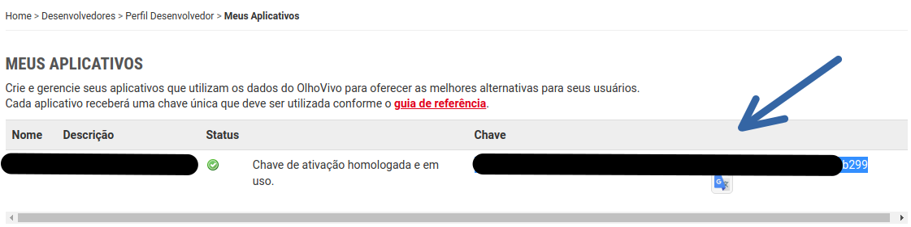
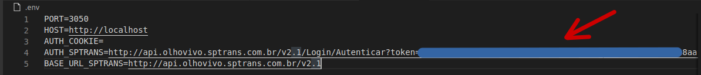

<h1 style="text-align: center;">Api SPTrans</h1>

<h2 style="text-align: center;">Download</h2>
 
 ```bash
    
    $ git clone https://github.com/theluposki/api-sptrans.git

    $ cd  api-sptrans/

 ```
<h3 style="text-align: center;">Configurando e instalando dependências</h3>
#### é preciso renomear o arquivo. 

```javascript 
    exemple.env  
```
#### para.

```javascript 
    .env  
```
#### configure as variáveis de ambiente do node .env

```env
    PORT={porta}
    HOST={host}
    AUTH_COOKIE=
    AUTH_SPTRANS=http://api.olhovivo.sptrans.com.br/v2.1/Login/Autenticar?token={token}
    BASE_URL_SPTRANS=http://api.olhovivo.sptrans.com.br/v2.1
```
#### Pegue o token no site da SPTrans

[SPTrans](http://www.sptrans.com.br/desenvolvedores/)



#### depois adicione o token no .env




### Instale as dependências.

 ```bash
    $ npm install

    $ npm start
 ```

<h4 style="text-align: center;">Rotas</h4>

- Para informações da aplicação:
    - ```/info```
    retorna um json:
    ```json

        {
            "code": 200,
            "status": "OK",
            "token": "apiCredentials=F2CB..."
        }

    ```
    no console:
    ```bash
        GET /info 200 444 - 7.147 ms
    ```

-  Para buscar informações de uma <b>Linha.</b>
    - ```/linha/7055``` busca por linha.
    retorna um json:
    ```json

    [
        {
            "cl": 1888,
            "lc": false,
            "lt": "7055",
            "sl": 1,
            "tl": 10,
            "tp": "TERM. CAMPO LIMPO",
            "ts": "JD. GUARUJÁ"
        },
        {
            "cl": 34656,
            "lc": false,
            "lt": "7055",
            "sl": 2,
            "tl": 10,
            "tp": "TERM. CAMPO LIMPO",
            "ts": "JD. GUARUJÁ"
        }
    ]

    ```
    no console:
    ```bash
        GET /linha/7055 200 192 - 5610.733 ms
    ```